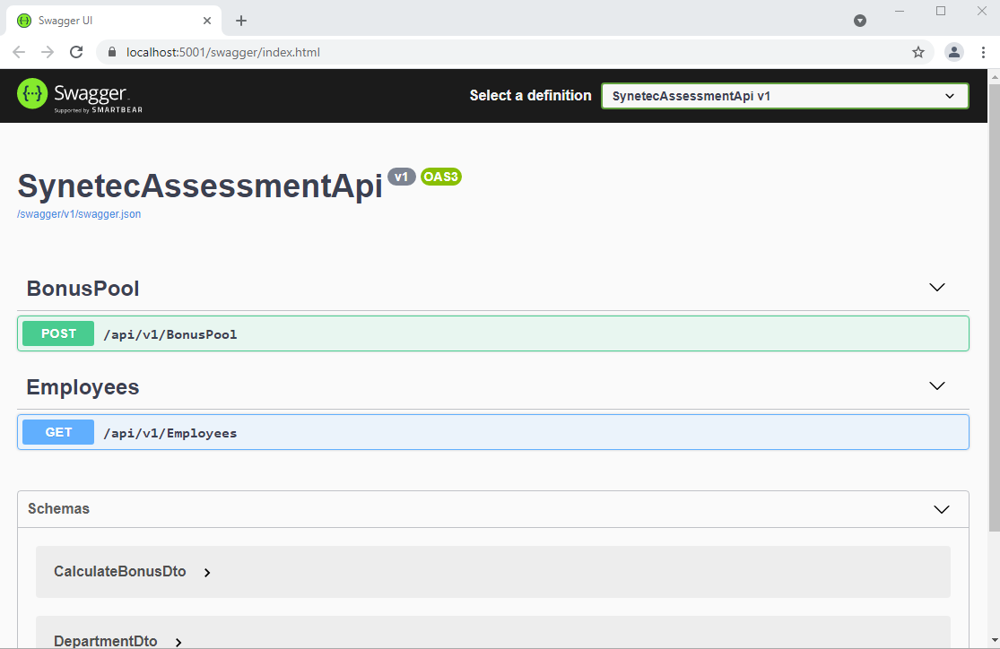
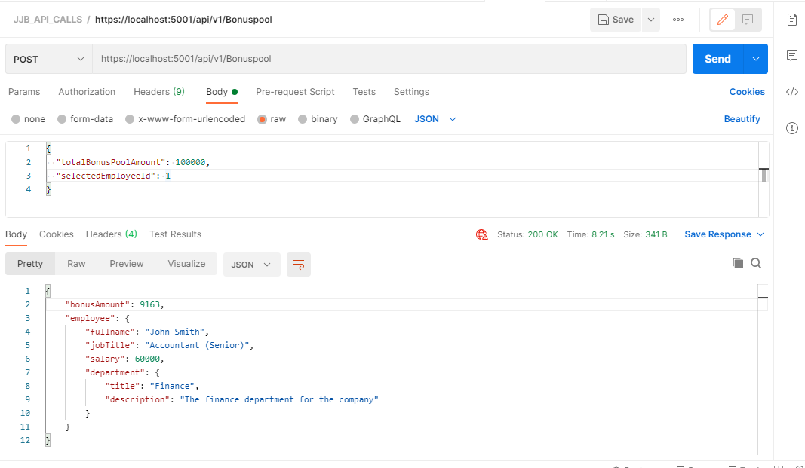

# BonusPool Calculator Light

## About
The aim fo this excercise is to build a Bonus calculator that will return the amount of bonus to be allocated to employees.


## Version history
The current API version is v.1 (Dev)
## Key Aspects

* TDD Approach has been taken to ensure that the calculations return the correct amount.
* DDD Approach is used to separate Domain knowledge from Application logic.(S in the SOLID Principles)
* Domain Models use the Privet Set setter. (Open/Closed principle)
* Interfaces are injected and used as contracts to access Services at the Service Layer. (I in Solid).

## DRY (Don not Repeat Yourself) Principles

* UnityOfWork Pattern: No extra layer of UnityofWork has been added since the project already uses the Microsoft DbContext which acts as the Singleton (hence UnitOfWork) pattern between the Database and the Application (aka Single Responsibility).
* Repository Pattern: No extra layer for generic repository have been added since the application uses the Microsot Entity Framework Core which implements the Repository pattern.

## Architecture

* The application closely follows the SOLID principles. A Service layer has been created in order to make the bridge between that Data Layer (DAL) and the Domain Layer.
Services are Injectd at run-time via .Net Core Dependency Injection.

* DTOs that existed at the presentation layer have been moved to the Service Layer in order to further separate concerns.

* Bonus calculations are performed at the Domain layer (CalculateBonus domain model) and accessible via the Service layer from the BonusPoolService service.

* Single Responsibility at Domain Layer. The CalculateBonus Domain model encapsulates the logic for the Bonus calculation. It is a good example of Single Responsibility.
## Typical responses

Responses are returned in Json format. Response Models have been created in order to keep consistency. Typical response status codes are also returned to assist developers with integration tasks.

## Unit Testing

Unit tests have been written to facilitate testing the application logic. 
xunit and Moq libraries were used in order to Mock the services at the service layer and to facilitate writing the test.

There are two set of tests:

* Controller Tests which test the controller's expected behaviour when the corresponding Service is injected.
* Calculator tests which are run against the Bonus calculator.

## Running the Applicaiton
Simply run the project from Visual Studio. A browser will open and the following UI will be displayed:



## Postman support
From Postman, use the following criteria:
```
http://{{baseUrl}}/api/v1/bonuspool/
```
Set headers as follows:
```
HEADERS => Content-Type: application/json
```
Lastly, pass the following JSon content (raw body):
```
{
  "totalBonusPoolAmount": 100000,
  "selectedEmployeeId": 1
}
```
The image below demonstrates a postman test



## Libraries

In addition to the standard Microsoft Net core libraries, The Test project uses the following libraries which are core to the architecture and functionality

* xunit 2.4.1
* Moq 4.16.1
* NLog 4.7.8

## Known issues

* Unit Test coverage covers just enough for the excercise but could potentially be increased.

## Notes
I wrote comments in the code where I felt clarification for my decisions were necessary and I hope those comments are clear enough to help the reader understand the resoning behind.

There is plenty of room for improvement and surely there are always better ways to achieve the desired result, however I enjoyed this challenge and am greatful for the opportunity to participate in it.

For any other issues please contact the [Developer](jhon.barreiro@gmail.com).
